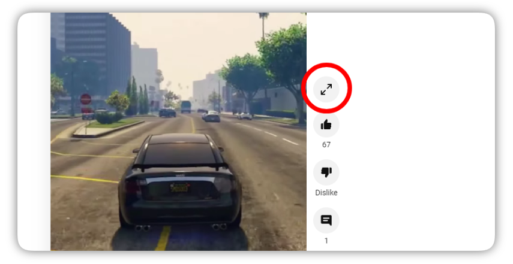

A chrome extension that adds a new button on the Youtube Shorts page that opens the video in a full video player. This is handy if you want to see some shorts video in a normal player.

### Installation and releases

Releases are available at https://github.com/denipolis/watch-shorts-fully/releases.

- Download **WatchShortsFullyExtX.X.X.zip**
- Unpack downloaded file.
- Go to [chrome://extensions](chrome://extensions)
- Check **"Developer mode"** in right top corner.
- Press **"Load unpacked"** in left top corner and select unpacked directory.
- **Enjoy!**

### Building
This operation will generate extension ready to load `/dist/` folder. Also this operation minifies code using [UglifyJS](https://github.com/mishoo/UglifyJS).
- `./build.sh`

