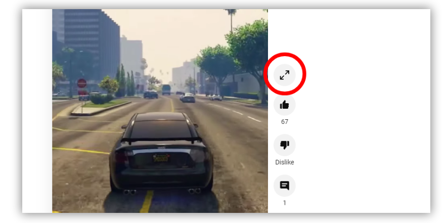

## Watch YouTube Shorts Fully
Chrome extension that adds button on YouTube Shorts page to watch youtube shorts in full media player.

## Building
This operation will generate extension ready to load `/dist/` folder. Also this operation minifies code using [UglifyJS](https://github.com/mishoo/UglifyJS).
- `./build.sh`